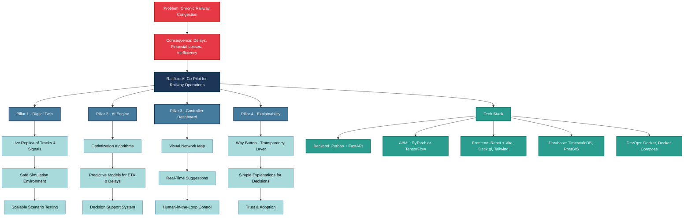

# 🚄 Railflux: AI-Powered Digital Twin for Intelligent Railway Traffic Control  

> **An AI Co-Pilot for Indian Railways — maximizing section throughput, minimizing delays, and building trust through Explainable AI.**  

---

## 📌 Problem Statement  
- **ID:** SIH24022 
- **Title:** Maximizing Section Throughput Using AI-Powered Precise Train Traffic Control  
- **Theme:** Transport & Logistics  
- **Category:** Software  

Indian Railways faces **congestion, cascading delays, and underutilized track capacity**. Current systems are largely reactive, lacking predictive intelligence and holistic network awareness.  

---

## 💡 Our Solution: *Railflux*  
**Railflux** is an **AI-powered Digital Twin system** that acts as an intelligent *co-pilot* for railway traffic controllers.  

🔑 **Core Components:**  
1. **Digital Twin Sandbox** – A real-time virtual replica of a railway section for risk-free AI training and scenario testing.  
2. **Hybrid AI Brain** –  
   - **Deep Reinforcement Learning (DRL):** Learns optimal routing and scheduling.  
   - **Predictive Models (LSTM):** Forecasts arrivals and delays.  
3. **Controller’s Dashboard** – A live, single-screen interface with AI suggestions, outcomes, and map visualizations.  
4. **Explainable AI Core** – A *“Why?” button* for transparent reasoning behind every AI recommendation.  

✅ **Impact:** Moves from **reactive firefighting → proactive optimization**, unlocking hidden capacity and improving reliability.  

---

## 🛠️ Technical Architecture  

| Layer        | Technology Stack |
|--------------|------------------|
| **Backend**  | Python, FastAPI, WebSockets |
| **AI/ML**    | PyTorch, TensorFlow, Scikit-learn, OpenAI Gym |
| **Frontend** | React.js (Vite), Deck.gl (maps), D3.js |
| **Database** | TimescaleDB (time-series), PostGIS |
| **DevOps**   | Docker, GitHub Actions, Vercel / Railway.app |

---

## 📊 Workflow Diagram  

---

## 🔍 Feasibility & Viability  

- **Technical Feasibility:** Proven tech (DRL, Digital Twins, FastAPI) + scalable cloud (AWS/GCP).  
- **Economic Feasibility:** Even **5% delay reduction** saves **millions** in fuel, crew hours, and capacity.  
- **Operational Feasibility:** Designed as a *decision-support tool*, ensuring low-risk phased adoption.
- 
---

## 🌍 Impact & Benefits  

**Economic:**  
- 💰 More trains per day → Increased revenue  
- ⛽ Lower fuel costs → Reduced wastage  
- ⏰ Fewer delays → Huge cost savings  

**Social:**  
- 👥 Better passenger punctuality  
- 👷 Safer operations with AI conflict prediction  

**Environmental:**  
- 🌿 Reduced emissions via optimized fuel use  

**Strategic:**  
- 🇮🇳 Boosts Indian Railways’ global competitiveness  

---

## 📚 Research & References  

- **Academic**  
  - *A Survey of Deep Reinforcement Learning for Train Scheduling* – IEEE T-ITS  
  - *Multi-Agent DRL for Railway Traffic Management* – AAMAS 2021  
- **Official Reports**  
  - [National Rail Plan 2024 – Ministry of Railways](https://indianrailways.gov.in)  
  - [data.gov.in – Indian Railways Public Data](https://data.gov.in/)  
- **Technical**  
  - [PyTorch RL Docs](https://pytorch.org) | [FastAPI Docs](https://fastapi.tiangolo.com) | [Deck.gl Docs](https://deck.gl)  
  - [Flatland Railway Traffic Simulator](https://www.aicrowd.com/challenges/flatland)  

---

## 🚀 Roadmap  

- [x] Define problem & research baseline AI models  
- [ ] Build Digital Twin sandbox prototype  
- [ ] Integrate DRL + LSTM hybrid AI brain  
- [ ] Develop Explainable AI “Why?” engine  
- [ ] Pilot on a defined railway section  
- [ ] Expand to multi-section network scaling  

---

## 👥 Team Railflux  

| Name | Role | Area |
|------|------|------|
| Sri Ram Varun Dittakavi | Team Lead | AI & Systems |
| Deepsai Yadamreddi | Backend Engineer | APIs & Integration |
| Soham Bacchuwar | Frontend Developer | UI/UX, Visualization |
| Smit Axaykumar Thakkar | Data Engineer | Simulation & DB |
| Yamini | Domain Expert | Rail Ops Research |
| Vishaka Meena | DevOps & Deployment Engineer | Cloud, CI/CD, Scalability |

---

## 📄 License  

This project is licensed under the MIT License – see the [LICENSE](LICENSE) file for details.  

---

🔥 **Railflux = Railways + AI + Trust.**  
We’re not just solving congestion — we’re redefining how Indian Railways thinks about traffic management.  
